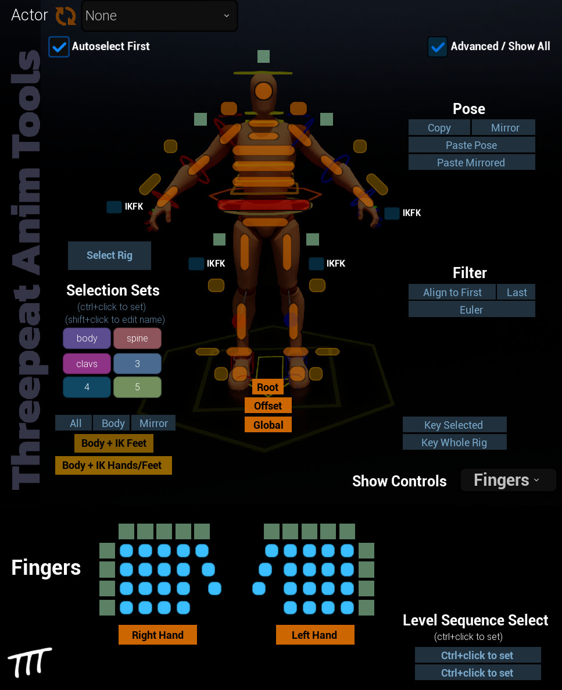

# Threepeat Anim Tools (TATools)

This repository contains Unreal 5.4+ curve editor filters and a heavily-modified MetaHuman character picker that works for both Metahuman and UE5-Mannequin-based control rigs.

<!---->

## Announcement/Walkthrough Video (click image to go to youtube video): 

## License

See LICENSE.txt for more license info, but all portions of the picker that came from Epic's Metahuman picker are the sole property of Epic Games and licensed as Unreal-only content by them (not me).  
My modifications are released via the BSD 3-clause license so that you can use this in the Unreal Editor (5.4+) for commercial and noncommercial projects.

Support licenses are available on request, reach out to threepeatgames@gmail.com for more information.

## Background

I'm building and releasing these tools to make animating in Unreal easier and faster for everyone.  My motive is to share what I've learned and build a large YT and discord community dedicated to progressing animation in unreal (animations can be easily used all game engines).  If you like this tool, please head over to https://youtube.com/@threepeatgames and subscribe and check out the videos.

## Installation

See Announcement/Walkthrough Video (above) for detailed step-by-step instructions.

This repo is a packaged version (with source code) of the plugin, so you can either download a zip or just clone this directly into your Plugins folder:

1. Go to the Unreal 5.4+ project where you'd like to install Threepeat AnimTools (TATools)
2. create a `Plugins` folder in the root of the project (it will be alongside the `Content` folder, for example)
3.  In the Plugins folder, run `git clone https://github.com/threepeatgames/ThreepeatAnimTools` or whatever your favorite git cloning is... Alternatively, just download the zip and extract it into the `Plugins` folder.
4.  You should now see a `ThreepeatAnimTools` folder inside `Plugins`
5.  restart your Unreal Project

## Supporting the project

If you want to support the project: https://buymeacoffee.com/threepeatgames

## Something's not working, what do I do?

Post an issue here with as much detail as needed to reproduce the issue.  Be descriptive!

## Pronunciation

 TATools sounds like tattoo and rhymes with pools.  Threepeat Anim Tools is also fine.
 
